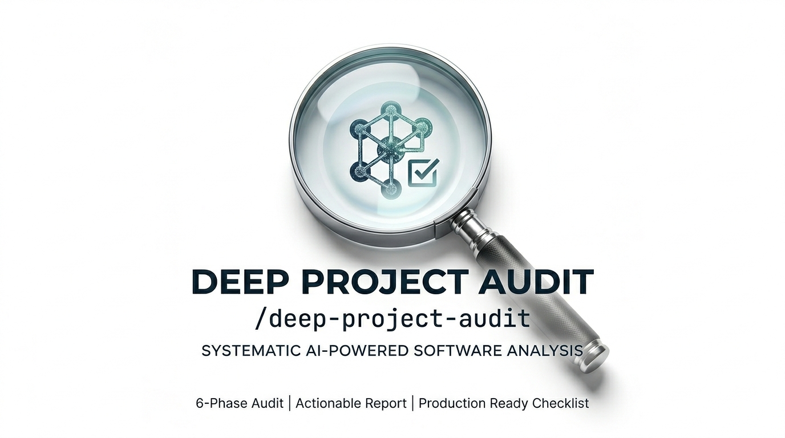

# Deep Project Audit

Run one command, get a full audit. Architecture, security, performance, resilience, docs - what's broken, what to fix first, and whether you or your agents can handle it.

> Works on anything you can point it at: agent systems, pipelines, web apps, CLIs, microservices, infra.

It's a [Claude Code Skill](https://code.claude.com/docs/en/skills) - six phases, one report, fixes ranked by impact.

I made this because I kept writing the same audit prompt from scratch every time I wanted to properly review a project. Started with a 12-agent pipeline on [Paperclip](https://github.com/paperclipai/paperclip), turned it into something that works on any project.



## Why this exists

I was running a 12-agent intelligence pipeline and every time I wanted to review the whole thing, I'd write a long audit prompt from scratch. Every time, I'd forget something. Sometimes security. Sometimes backup validation. Sometimes I just wouldn't look at how the agents coordinate with each other.

It's never the obvious stuff. It's always the thing you assumed was fine until it wasn't.

So I made it into a skill. Same checklist, same order, every time. Now I run one command and know I'm not skipping anything. It also finds things I wasn't looking for, which surprised me. After using it on a few projects I figured other people might find it useful too.

## What it does

One command. Full analysis. Actionable output.

```
/deep-project-audit
```

The audit discovers your project structure dynamically, reads everything, queries databases, tests backup integrity, and produces a structured report covering:

- Architecture and code quality - design patterns, MECE analysis, contradictions, scalability, test coverage
- Error handling and resilience - crash scenarios, timeout coverage, silent failures, data integrity, edge cases
- Performance and bottleneck analysis - timing, parallelism, scaling limits, resource waste, cost analysis
- Security and data exposure - secrets, injection vulnerabilities, PII, supply chain, workflow security
- Logging and observability - structured logs, traceability, alerting, monitoring
- Documentation quality - accuracy vs codebase, completeness, onboarding readiness
- Production readiness - 10-gate PASS/PARTIAL/FAIL checklist with a ship/no-ship verdict
- Ranked recommendations - top 10 actions with impact, effort, and who implements

## How it works

### Phase 1: Discover
Looks at the project before assuming anything. Maps the structure, checks git history, reads the README, then asks you to confirm scope before burning tokens.

### Phase 2: Read (parallel)
Sends 4 agents to read everything at once. One covers config and architecture, one covers execution logic, one reads outputs and docs, one counts files and checks data stores.

### Phase 3: Diagnose
If there's a database, it connects and queries it. Checks table sizes, failure rates, data freshness. If there's no database, it skips this.

### Phase 4: Analyze
This is where the actual opinions come in. Architecture review, error handling audit, performance analysis, resource waste. Everything quantified where possible.

### Phase 5: Assess
Security scan, PII check, documentation accuracy, whether the project actually does what it claims to do. Ends with the ranked recommendations and the uncomfortable question.

### Phase 6: Test resilience
Checks whether backups actually restore (not just whether they exist). Traces what happens when components fail.

## What happens after

The report is built so you can act on it immediately. You can say:

```
Fix them all
```

and it becomes the implementation plan. Or pick specific items, ask for more detail on a section, or re-run just one phase after you've made changes.

## Installation

### Claude Code (CLI or Desktop)

```bash
git clone https://github.com/belousov-petr/deep-project-audit.git
mkdir -p ~/.claude/skills/deep-project-audit
cp deep-project-audit/SKILL.md ~/.claude/skills/deep-project-audit/SKILL.md
```

Or grab just the skill file:

```bash
mkdir -p ~/.claude/skills/deep-project-audit
curl -o ~/.claude/skills/deep-project-audit/SKILL.md \
  https://raw.githubusercontent.com/belousov-petr/deep-project-audit/main/SKILL.md
```

Restart Claude Code. It shows up as `/deep-project-audit`.

### Any skills-compatible agent (cross-client)

Use the `.agents/skills/` path for compatibility with Cursor, Gemini CLI, Copilot, and [30+ other clients](https://agentskills.io/home):

```bash
mkdir -p ~/.agents/skills/deep-project-audit
curl -o ~/.agents/skills/deep-project-audit/SKILL.md \
  https://raw.githubusercontent.com/belousov-petr/deep-project-audit/main/SKILL.md
```

Or install at project level (travels with the repo):

```bash
mkdir -p .agents/skills/deep-project-audit
curl -o .agents/skills/deep-project-audit/SKILL.md \
  https://raw.githubusercontent.com/belousov-petr/deep-project-audit/main/SKILL.md
```

## Usage

Go to your project directory and run `/deep-project-audit`. You should see it start mapping your project structure.

It also activates from natural language. Any of these will trigger it:

- "audit this project"
- "find the weak spots"
- "is this production ready"
- "what's wrong with this"
- "do a health check on this project"
- "how mature is this"
- "due diligence on this codebase"
- "assess technical debt"
- "gap analysis"

### The report covers

1. What the project is (derived from reading, not assumed)
2. What's genuinely good, with evidence
3. What will break soon, with evidence
4. Architecture problems, MECE gaps, contradictions
5. Error handling: crash paths, silent failures, edge cases
6. Performance: bottlenecks, waste, cost
7. Security: secrets, injection risks, PII
8. Logging and monitoring gaps
9. Documentation: accuracy, completeness, onboarding
10. Goal fulfillment: stated vs actual behavior
11. Blind spots nobody is watching
12. Ratings (8 dimensions, scored 1-10)
13. Overall score with justification
14. Production readiness (10 gates, ship/no-ship verdict)
15. Top 10 ranked fixes with effort estimates
16. The uncomfortable question

## Works on

| Project type | What gets checked |
|---|---|
| Agent systems (Paperclip, CrewAI, AutoGen) | Instructions, heartbeats, coordination, pipeline flow, signal quality |
| Web apps | Routes, API design, auth, DB schema, frontend/backend split |
| Data pipelines | Stage flow, data integrity, scheduling, error handling, throughput |
| CLI tools | Argument handling, error messages, edge cases, docs |
| Monorepos | Package boundaries, dependencies, build system, cross-package consistency |
| Microservices | Service boundaries, API contracts, resilience, observability |

## How it thinks

A few rules I keep coming back to when reviewing my own projects:

1. Look at the project before making assumptions about it. Map first, read second.
2. Check with the user before going deep. "This is what I found, this is what I'll audit - sound right?" saves everyone's time.
3. Don't critique what you haven't read.
4. Put numbers on things. "23% duplicate rate" is useful. "Some duplicates" is not.
5. Compare what the docs say against what the code does. The gap between those two is where most problems hide.
6. Every recommendation answers four things: what, why, how much work, who does it. Anything less is just complaining.
7. The audit should be useful now, not next sprint. If you can say "fix them all" and start working immediately, it did its job.
8. Test the safety nets. Backups exist? Restore one. Retry logic? Trace what happens when it fires. Don't report that something exists - report whether it works.
9. Find what's wrong, not just what's right. The point is to make the project better, not to feel good about it.
10. Surface the constraints nobody talks about: rate limits, daily budgets, peak hour pricing. Those shape what's actually possible more than architecture does.

## Benchmark results

Tested on 3 real projects: a content pipeline (~2,800 lines Python), a 16-agent AI intelligence pipeline, and a browser automation tool (~1,000 lines JS). Each project was audited twice - once with the skill active, once with a bare "audit this project" prompt (no methodology).

The output was graded against 18 structural completeness checks (see `scripts/validate-output.py`).

| Project | With skill | Without skill | Delta |
|---------|-----------|--------------|-------|
| Content pipeline | 18/18 (100%) | 1/18 (5%) | +95% |
| Agent pipeline | 18/18 (100%) | 2/18 (11%) | +89% |
| Browser tool | 18/18 (100%) | 3/18 (16%) | +84% |
| **Average** | **100%** | **11%** | **+89%** |

The bare audits found real issues but produced freeform prose. They consistently missed: production readiness gates, objective clarity ratings, structured recommendations with impact/effort/who columns, security analysis, logging assessment, goal fulfillment check, blind spots, and "the uncomfortable question." Full reports in `examples/`.

## Token usage

The skill itself costs ~3,500 tokens to load (the SKILL.md file). The audit output uses 50K-300K tokens across all 6 phases, depending on project size:

| Project type | Files | Tokens | Example |
|---|---|---|---|
| Small CLI/browser tool | ~20 | ~50K | [`benchmark-audit-c.md`](examples/benchmark-audit-c.md) |
| Medium pipeline | ~50 | ~150K | [`benchmark-audit-a.md`](examples/benchmark-audit-a.md) |
| Large agent system | 600+ | ~250K | [`benchmark-audit-b.md`](examples/benchmark-audit-b.md) |

## Project structure

```
deep-project-audit/
├── SKILL.md                              # The skill - loaded when activated
├── references/
│   ├── db-diagnostics.md                 # Phase 3: database-specific queries
│   ├── security-checklist.md             # Section 5.1: full security checks
│   ├── performance-analysis.md           # Section 4.6: full performance checks
│   └── resilience-testing.md             # Phase 6: backup and resilience tests
├── examples/
│   ├── benchmark-audit-a.md              # With-skill audit: content pipeline
│   ├── benchmark-audit-b.md              # With-skill audit: agent pipeline
│   ├── benchmark-audit-c.md              # With-skill audit: browser tool
│   ├── baseline-audit-a.md               # Without-skill baseline: content pipeline
│   ├── baseline-audit-b.md               # Without-skill baseline: agent pipeline
│   └── baseline-audit-c.md               # Without-skill baseline: browser tool
├── evals/
│   ├── evals.json                        # 5 test cases with 35 assertions
│   └── README.md                         # How to run and grade evals
├── scripts/
│   └── validate-output.py                # 18-check output completeness validator
├── README.md
└── LICENSE                               # CC BY 4.0
```

The main SKILL.md contains the methodology and output format. Detailed checklists are in `references/` and loaded on demand - this keeps activation cost low while preserving depth.

## Validation

Validate the skill against the [Agent Skills specification](https://agentskills.io/specification):

```bash
npx skills-ref validate ./deep-project-audit
```

This checks frontmatter fields, naming conventions, and directory structure compliance.

## Contributing

If you've run this and found gaps, I'd like to hear about it. Open an issue or PR with:

1. What kind of project you audited
2. What the skill should have checked but didn't
3. What you'd add to fill that gap

## License

[CC BY 4.0](https://creativecommons.org/licenses/by/4.0/). Use it, share it, adapt it for anything including commercial work. Just give credit.

## Author

Petr Belousov

- GitHub: [@belousov-petr](https://github.com/belousov-petr)
- LinkedIn: [petrbelousov](https://www.linkedin.com/in/petrbelousov/)
