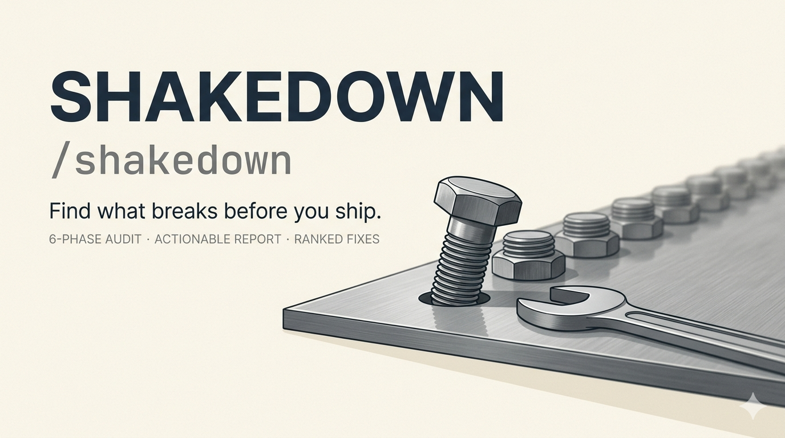

# Shakedown

One-command review for any codebase. Finds what breaks before you ship - architecture, security, performance, resilience, docs. Ranks the fixes by impact and tells you which ones your agents can handle.

> Works on anything you can point it at: agent systems, pipelines, web apps, CLIs, microservices, infra.

In 2026 the code is cheap. Writing down what you built - the tradeoffs, what's fragile, what you left out on purpose - still takes work. This skill is how I make myself do it, in a form someone else can read.

A [Claude Code Skill](https://code.claude.com/docs/en/skills). Six phases, one report, fixes ranked by impact.

I built this because I kept writing the same review prompt from scratch every time I wanted to properly look at a project. Started as a 12-agent pipeline on [Paperclip](https://github.com/paperclipai/paperclip), ended up as something that works on any project.



## Why this exists

I was running a 12-agent intelligence pipeline and every time I wanted to review the whole thing, I'd write a long prompt from scratch. Every time, I'd forget something. Sometimes security. Sometimes backup validation. Sometimes I just wouldn't look at how the agents coordinate with each other.

What gets me is usually something I'd trusted enough to stop watching.

So I made it into a skill. Same checklist, same order, every time. Now I run one command and know I'm not skipping anything. It also finds things I wasn't looking for, which surprised me. After using it on a few projects I figured other people might find it useful too.

## What it does

One command. Full analysis. Actionable output.

```
/shakedown
```

The review discovers your project structure dynamically, reads everything, queries databases, tests backup integrity, and produces a structured report covering:

- Architecture and code quality - design patterns, MECE analysis, contradictions, algorithm efficiency, dependency graph, test coverage
- Error handling and resilience - crash scenarios, timeout coverage, silent failures, data integrity, edge cases, retry patterns, graceful degradation
- Performance and bottleneck analysis - timing, parallelism, scaling limits, resource waste, cost analysis
- Code and storage efficiency - empty files, duplicates, dead dependencies, build artifacts, storage bloat
- Security and data exposure - secrets, injection vulnerabilities, PII, supply chain, workflow security, licensing compliance
- Logging and observability - structured logs, traceability, alerting, monitoring
- Documentation quality - accuracy vs codebase, completeness, onboarding readiness
- Value assessment - problem clarity, target audience, maturity vs claims, differentiation, adoption readiness
- Agent skill compliance - agentskills.io spec validation (conditional, for skill projects)
- Production readiness - 10-gate PASS/PARTIAL/FAIL checklist (you call the ship/no-ship yourself)
- Ranked recommendations - top 10 actions with impact, effort, and who implements

## Installation

### Claude Code (CLI or Desktop)

Clone the full skill (recommended - includes reference checklists for deeper reviews):

```bash
git clone https://github.com/belousov-petr/shakedown.git
mkdir -p ~/.claude/skills/shakedown
cp -r shakedown/SKILL.md shakedown/references ~/.claude/skills/shakedown/
```

Or grab just the core skill file (works but loses 11 reference checklists - shallower review):

```bash
mkdir -p ~/.claude/skills/shakedown
curl -o ~/.claude/skills/shakedown/SKILL.md \
  https://raw.githubusercontent.com/belousov-petr/shakedown/master/SKILL.md
```

Restart Claude Code. It shows up as `/shakedown`.

### Any skills-compatible agent (cross-client)

Use the `.agents/skills/` path for compatibility with Cursor, Gemini CLI, Copilot, and [30+ other clients](https://agentskills.io/home):

```bash
git clone https://github.com/belousov-petr/shakedown.git
mkdir -p ~/.agents/skills/shakedown
cp -r shakedown/SKILL.md shakedown/references ~/.agents/skills/shakedown/
```

Or install at project level (travels with the repo):

```bash
mkdir -p .agents/skills/shakedown
git clone https://github.com/belousov-petr/shakedown.git /tmp/shk
cp -r /tmp/shk/SKILL.md /tmp/shk/references .agents/skills/shakedown/
rm -rf /tmp/shk
```

## How it works

### Phase 1: Discover
Looks at the project before assuming anything. Maps the structure, checks git history, reads the README, detects if it's an agent skill (triggers extra checks in Phase 4), then asks you two quick things: is the scope right, and do you want the report **inline or saved to a file**. More on that below.

### Phase 2: Read (parallel)
Sends 4 agents to read everything at once. One covers config and architecture, one covers execution logic, one reads outputs and docs, one counts files and checks data stores.

### Phase 3: Diagnose
If there's a database, it connects and queries it. Checks table sizes, failure rates, data freshness. If there's no database, it skips this.

### Phase 4: Analyze
This is where the actual opinions come in. Architecture review, error handling review, performance analysis, storage efficiency, resource waste. If the project is an agent skill, it also gets evaluated against the agentskills.io specification. Everything quantified where possible.

### Phase 5: Assess
Security scan, PII check, documentation accuracy, whether the project actually does what it claims to do. Includes a value assessment - does this project solve a real problem, for a clear audience, with measurable value? Ends with the ranked recommendations and the uncomfortable question.

### Phase 6: Test resilience
Checks whether backups actually restore (not just whether they exist). Traces what happens when components fail.

## Inline vs. file mode

Before Phase 2, the skill asks how you want it delivered. Both modes stream the full report into the current session - so "fix them all" works either way. The only difference is whether you also walk away with a saved artifact.

| Mode | What happens |
|---|---|
| **Inline** (default) | Full report in the session. Nothing saved to disk. |
| **File** | Full report in the session AND saved to `shakedown-YYYY-MM-DD.md` in the project root. Pick this when you want a standalone file to archive, share, or feed into a fresh session later. |

File mode isn't a standalone CLI - same session, same agent, same tools. The save-to-disk step just gives you a durable copy of what's already in front of you.

## Usage

Go to your project directory and run:

```
/shakedown
```

It also activates from natural language. These phrases trigger a full review:

```
review this project
find the weak spots
how solid is this project
how mature is this project
what would break first
where does this need tightening
assess technical debt
do a project health check
```

Claude Code matches your request against the skill's description - any phrasing around reviewing, health checking, or stress-testing a whole project should trigger it. It won't activate for simple code reviews or single-file analysis.

### The report covers

1. What the project is (derived from reading, not assumed)
2. What's genuinely good, with evidence
3. What will break soon, with evidence
4. Architecture problems, MECE gaps, contradictions, algorithm efficiency
5. Error handling: crash paths, silent failures, edge cases, retry patterns
6. Performance: bottlenecks, waste, cost
7. Code and storage efficiency: empty files, duplicates, dead deps, bloat
8. Agent skill compliance (if applicable): spec, description, instructions, evals
9. Security: secrets, injection risks, PII, licensing
10. Logging and monitoring gaps
11. Documentation: accuracy, completeness, onboarding
12. Goal fulfillment: stated vs actual behavior
13. Blind spots nobody is watching
14. Ratings (8 dimensions, scored 1-10)
15. Overall score with justification
16. Production readiness (10 gates; you call the ship/no-ship yourself)
17. Top 10 ranked fixes with effort estimates
18. Value assessment: problem clarity, audience, maturity, differentiation
19. The uncomfortable question

### Focused checks (without running the full review)

The reference files in `references/` are self-contained checklists. You can use them individually for targeted reviews without running the full 6-phase flow. Just point your agent at the specific file:

| If you want to check... | Use this file |
|---|---|
| Architecture, MECE gaps, algorithms, test coverage | `references/architecture-quality.md` |
| Error handling, crash paths, resilience | `references/error-resilience.md` |
| Performance, bottlenecks, scaling, cost | `references/performance-analysis.md` |
| File waste, duplicates, dead dependencies | `references/storage-efficiency.md` |
| Agent skill spec compliance | `references/skill-standards.md` |
| Security, secrets, injection, PII, licensing | `references/security-checklist.md` |
| Logging, docs quality, blind spots | `references/operational-health.md` |
| Problem clarity, audience, maturity, value | `references/value-assessment.md` |
| Database health, schema, freshness | `references/db-diagnostics.md` |
| Backup validation, disaster recovery | `references/resilience-testing.md` |

Example: "Review this project's security using the checklist in `references/security-checklist.md`"

## How it compares to other review tools

Anthropic shipped `/ultrareview` in April 2026 alongside Opus 4.7. It's a PR-time bug hunter that runs in Anthropic's cloud, spawns multiple reviewer agents, and reproduces every finding before reporting. Worth using. But it's a different job from this skill, and so are the other review tools that already live in most engineering stacks.

| | /ultrareview | /shakedown | SonarQube / CodeRabbit | Snyk |
|---|---|---|---|---|
| Scope | branch / PR diff | whole project | file or PR diff | dependencies + code |
| Trigger | before merge | any time | continuous / on PR | CI or IDE |
| Runtime | Anthropic's cloud | your local Claude Code | cloud or self-hosted | cloud |
| Output | reproduced bug list | 14-section report | rule violations / AI review comments | CVE list + upgrade paths |
| Style | reproduces each finding before reporting | ranked fixes + opinion + the uncomfortable question | rule-based, high volume | vulnerability scanning |
| Cost | 3 free on Pro/Max, then $5-20/run | free (you pay Claude tokens) | free tier + paid | free tier + paid |

Use `/ultrareview` when you're about to merge. SonarQube or CodeRabbit for rule-based coverage on every PR. Snyk for dependencies and CVEs. Use `/shakedown` when you want one opinionated pass on what's weak across the whole project - code, docs, the value story, adoption readiness, and the gap between what the project claims and what it actually does.

## What to do with the report

The report is built so you can act on it immediately. Here's what you can say after the review finishes:

| Say this | What happens |
|----------|-------------|
| `Fix them all` | Starts implementing all recommendations in priority order |
| `Fix the critical ones` | Only tackles items rated Critical or FAIL |
| `Explain recommendation #3 in detail` | Deep-dive into a specific finding with implementation steps |
| `Re-run Phase 5 only` | Re-checks just one phase after you've made changes |
| `Create GitHub issues for each recommendation` | Turns findings into trackable issues |
| `Prioritize for a solo developer` | Filters by what a human needs to do vs what agents can handle |
| `Compare with the last review` | If you've run it before, diffs the reports to show progress |

## How it thinks

A few rules I keep coming back to when reviewing my own projects:

1. Look at the project before making assumptions about it. Map first, read second.
2. Check with the user before going deep. "This is what I found, this is what I'll review - sound right?" saves everyone's time.
3. Don't critique what you haven't read.
4. Put numbers on things. "23% duplicate rate" is useful. "Some duplicates" is not.
5. Compare what the docs say against what the code does. The gap between those two is where most problems hide.
6. Every recommendation answers four things: what, why, how much work, who does it. Anything less is just complaining.
7. The report should be useful now, not next sprint. If you can say "fix them all" and start working immediately, it did its job.
8. Test the safety nets. Backups exist? Restore one. Retry logic? Trace what happens when it fires. Don't report that something exists - report whether it works.
9. Find what's wrong, not just what's right. The point is to make the project better, not to feel good about it.
10. Surface the constraints nobody talks about: rate limits, daily budgets, peak hour pricing. Those shape what's actually possible more than architecture does.

## What I didn't build, and why

A few adjacent features I thought about and left out.

- **Not a standalone CLI or npm package.** The review needs to run in the same session as the agent that will actually fix things. A subprocess produces a report and the context is gone by the time anyone reads it. File mode (above) is still same-session - it just writes to disk so you can choose to pick it up in a fresh session later.
- **Not a GitHub Action or PR-time gate.** That's `/ultrareview`'s job. Shakedown is for the quieter moments: between sprints, the end of a stretch of work, something feels off but the tests are green. Running it on every PR would be the wrong incentive.
- **No single composite score.** "7.2/10" is marketing. Eight dimensions and a ranked top-10 push you into a conversation about what to fix, not a number for a slide.
- **No auto-fix mode.** You say "fix them all" yourself. Running automatic fixes on a report nobody has read is the failure this skill is meant to catch.
- **No built-in Linear or Jira integration.** Turning findings into tickets is one prompt away. Owning vendor APIs on behalf of people who might not use them is maintenance I don't want.

## Where I overrode Claude during construction

Claude wrote most of this under my direction. Plenty of what it suggested didn't make the cut. Three rewrites worth naming.

- **Composite score, replaced with eight dimensions.** Its first draft put a 7.2/10 number at the top. I took it out because one number collapses judgment into a vibe, and the whole point of the report is to resist that.
- **Overlapping reference files, split with scope boundaries.** Early versions of `security-checklist.md` and `operational-health.md` would flag the same missing log line two or three times. I added scope notes to each file so a finding lands once, in one place.
- **Vague recommendations, rewritten to a four-part structure.** It kept generating items like "consider adding error handling." I changed the prompt so every recommendation has to answer four questions: what, why, how much work, who does it. Anything short of that is just complaining.

## What building this taught me

Three things that got baked into the rules after I learned them the hard way.

- **Existing and working are different things.** Phase 6 actually restores a backup instead of checking that one is configured. That came out of a pipeline where backups "existed" for months and then failed on the first real restore. Same for retry logic. If you don't trace what happens when the code fires, you're reporting that the code exists, not that the system behaves.
- **Validators check structure, not quality.** `scripts/validate-output.py` runs 22 objective checks - is there a readiness table, a ranked fix list, a value section. Whether the findings are actually correct is the report's job, not the validator's. I tried semantic checks in the validator once. They got subjective fast and I pulled them.
- **If you can't act on a report the day you get it, it's close to worthless.** That's why there's a follow-up prompt table. The first reports I produced were too long and too soft to drive a session. "Fix them all" and "open a GitHub issue for each one" need to be live options the moment the report finishes, or none of this matters.

## Works on

| Project type | What gets checked |
|---|---|
| Agent systems (Paperclip, CrewAI, AutoGen) | Instructions, heartbeats, coordination, pipeline flow, signal quality |
| Web apps | Routes, API design, auth, DB schema, frontend/backend split |
| Data pipelines | Stage flow, data integrity, scheduling, error handling, throughput |
| CLI tools | Argument handling, error messages, edge cases, docs |
| Monorepos | Package boundaries, dependencies, build system, cross-package consistency |
| Microservices | Service boundaries, API contracts, resilience, observability |

## Benchmark results

Tested on 3 real projects: a personal media content pipeline (Python, ~56 files, yt-dlp + Whisper + static HTML gallery), a 17-agent Claude-based intelligence pipeline (live Postgres, 3,344 LOC of agent instructions + ~1,500 LOC Python), and a browser-automation tool (~1,950 LOC JavaScript, 4 files). Each project was reviewed twice - once with the skill active, once with a bare "review this project" prompt. **Both runs used Claude Opus 4.7** for a fair comparison. Output was graded against `scripts/validate-output.py` (21 structural checks, plus 1 conditional Skill Standards check for reviews that cover agent-skill projects).

| Project | With skill | Without skill | Delta |
|---------|-----------|---------------|-------|
| Personal media content pipeline (medium Python) | 22/22 (100%) | 0/21 (0%) | +100% |
| 17-agent intelligence pipeline (large) | 22/22 (100%) | 2/21 (10%) | +90% |
| Browser automation tool (small JS) | 22/22 (100%) | 1/21 (5%) | +95% |
| **Average** | **100%** | **5%** | **+95%** |

The bare prompts find real bugs. They just don't organize them. Without the skill - even on Opus 4.7 - no readiness table, no ratings, no ranked fix list, no uncomfortable question. The findings are in there somewhere, but you'd have to re-read everything to act on them. Full reports in `examples/`.

## Token usage

The skill itself costs ~3,500 tokens to load (the SKILL.md file). Measured token usage across the 3 reference reviews above (Opus 4.7, 1M context):

| Project type | Files read | Tokens | Duration | Example |
|---|---|---|---|---|
| Small CLI/browser tool (~2K LOC) | 15 | ~95K | ~15 min | [`benchmark-review-c.md`](examples/benchmark-review-c.md) |
| Medium personal pipeline (~56 files + JSONL manifests) | 32 | ~165K | ~45 min | [`benchmark-review-a.md`](examples/benchmark-review-a.md) |
| Large agent system (17 agents + live Postgres + 4K LOC) | 34 | ~125K | ~32 min | [`benchmark-review-b.md`](examples/benchmark-review-b.md) |

Token usage scales roughly with source-code size + database query count, not file count - the large agent system had fewer source files than the medium pipeline but hit a live Postgres with 68 tables during Phase 3.

## Project structure

```
shakedown/
├── SKILL.md                              # The skill - orchestrator
├── references/
│   ├── architecture-quality.md           # Section 4.4: structure, MECE, algorithms, tests
│   ├── error-resilience.md               # Section 4.5: crashes, timeouts, edge cases
│   ├── performance-analysis.md           # Section 4.6: timing, scaling, cost
│   ├── storage-efficiency.md             # Section 4.7: empty files, duplicates, bloat
│   ├── skill-standards.md                # Section 4.8: agentskills.io compliance
│   ├── db-diagnostics.md                 # Phase 3: database-specific queries
│   ├── security-checklist.md             # Section 5.1: OWASP-derived - secrets, injection, PII, licensing, LLM/Agentic/MCP risks
│   ├── operational-health.md             # Sections 5.2/5.3/5.5: logging, docs, blind spots
│   ├── value-assessment.md               # Section 5.10: problem, audience, maturity
│   ├── resilience-testing.md             # Phase 6: backup and resilience tests
│   └── gotchas.md                        # 10 common agent review mistakes
├── examples/
│   ├── benchmark-review-a.md             # With-skill review: content pipeline
│   ├── benchmark-review-b.md             # With-skill review: agent pipeline
│   ├── benchmark-review-c.md             # With-skill review: browser tool
│   ├── baseline-review-a.md              # Without-skill baseline: content pipeline
│   ├── baseline-review-b.md              # Without-skill baseline: agent pipeline
│   └── baseline-review-c.md              # Without-skill baseline: browser tool
├── evals/
│   ├── evals.json                        # 7 test cases with 51 assertions
│   └── README.md                         # How to run and grade evals
├── scripts/
│   └── validate-output.py                # 22-check output completeness validator
├── README.md
└── LICENSE                               # MIT
```

The main SKILL.md is a clean orchestrator - phases, flow, output templates. All detailed checklists live in `references/` (11 files, 3,202 lines) and are loaded on demand. This keeps activation cost low while preserving depth. Each reference file includes scope boundary notes to prevent overlap.

## A few honest things

Before you use this on anything serious.

- LLM reviews spot patterns, not truth. What comes back is a pile of "this looks suspicious" - still on you to read the code, check whether it's actually a problem, and figure out the fix. Especially for security, or anything users actually touch. If a finding looks important, don't take my word for it. Read the code.

- Don't mistake this for due diligence. Compliance, audit trails, threat models, multiple humans signing off - none of that is here. What you get is a first pass from one LLM. Useful, not definitive.

- The fit is small stuff you care about but haven't cleaned up. Solo tools, prototypes, side experiments, things that have been sitting untouched for months. The idea is to un-slop them before the mess starts dictating decisions, and to walk away with a shortlist you can actually work through. For anything with real stakes, pay a human to look.

- Bad fit for heavy monorepos. The parallel-read phase assumes one agent can hold the architecture in its head. A 30-package monorepo with cross-service coupling doesn't fit that assumption. Run it per package, not on the root.

## Contributing

If you've run this and found gaps, I'd like to hear about it. Open an issue or PR with:

1. What kind of project you reviewed
2. What the skill should have checked but didn't
3. What you'd add to fill that gap

## License

[MIT](LICENSE). Use it, fork it, ship it - credit appreciated but not required.

## Acknowledgments

Claude Code ([@claude](https://github.com/claude)) wrote this - the skill, the references, the tests, the docs. I designed the review flow and check structure, decided what gets reviewed and why, and directed the work. Division of labor: mine is judgment, Claude's is typing speed.

For security and skill-compliance specifically, I reused two established sources instead of inventing my own:

- [Agent Skills specification](https://agentskills.io/specification). The skill is built to conform to it. Run `npx skills-ref validate ./shakedown` to check your install (frontmatter, naming, directory structure).
- [OWASP GenAI Security Project](https://genai.owasp.org/). The security checks, questions, and red-team procedures in `references/security-checklist.md` come straight from OWASP's GenAI publications - LLM Top 10, Agentic Top 10, Secure MCP, GenAI Data Security, Governance Checklist, Red Teaming Guide. If your project touches LLMs or agents, those documents are worth reading directly.

Companion skill: [`/savepoint`](https://github.com/belousov-petr/savepoint) for saving and restoring Claude Code project state across sessions.

## Author

Petr Belousov

- GitHub: [@belousov-petr](https://github.com/belousov-petr)
- LinkedIn: [petrbelousov](https://www.linkedin.com/in/petrbelousov/)
